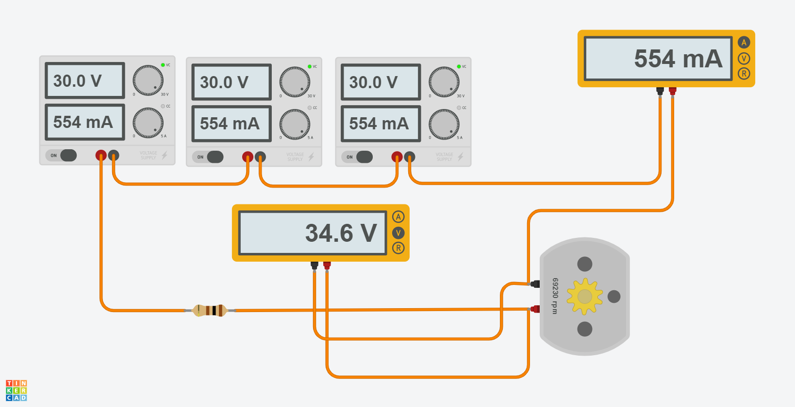

# Робототехника 10

#### [Ссылка на проект tinkercad.com](https://www.tinkercad.com/things/arQkhy3RhaI-start-simulating/editel?lessonid=EHD2303J3YPUS5Z&projectid=OIYJ88OJ3OPN3EA&collectionid=OIYJ88OJ3OPN3EA&sharecode=w7gx2d5GR8NCYS2jetIyJ4tvoWxDZiSxaKI9lfHK-1o)
Cсылка действительная в течении 336 ч. после отправки задания.

### Сила тока на моторе: **554 мА** 
### Напряжение на моторе: **34.6 В**
### Количество оборотов мотора: **69230 об/мин**

## P.S.
В tinkercad нельзя создать источник питания с напряжением > 30 В, поэтому
мы использовали три источника питания на 30 В и соединили их последовательно.
