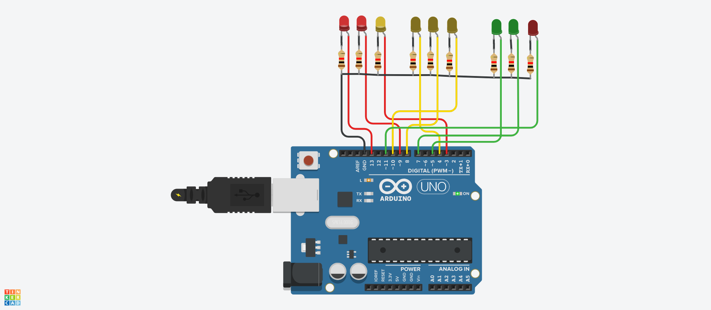

# Робототехника 20

#### [Ссылка на проект tinkercad.com](https://www.tinkercad.com/things/j3825kRLdcA-super-jarv/editel?sharecode=6ydrWVf3OpMGfXTvKV2beWypuJYVlPnwpZ814143tV4)
Cсылка действительная в течении 336 ч. после отправки задания.



## Код прошивки

```c++
int ledPins[3][3] = {{3, 9, 13}, {4, 8, 10}, {5, 7, 11}};

void setup() {
  for (int i = 0; i < 3; i++) {
    for (int j = 0; j < 3; j++) {
      pinMode(ledPins[i][j], OUTPUT);
    }
  }
}

void loop() {
  for (int i = 0; i < 3; i++) {
    for (int j = 0; j < 3; j++) {
      digitalWrite(ledPins[i][j], HIGH);
    }
    delay(3000);
    for (int j = 0; j < 3; j++) {
      digitalWrite(ledPins[i][j], LOW);
    }
  }
}
```