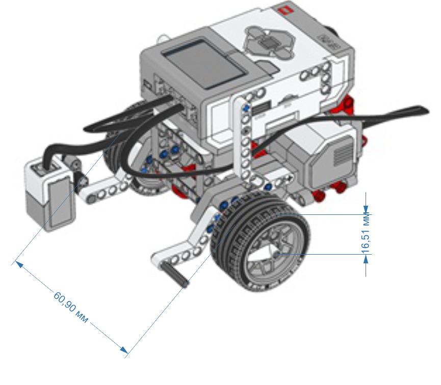
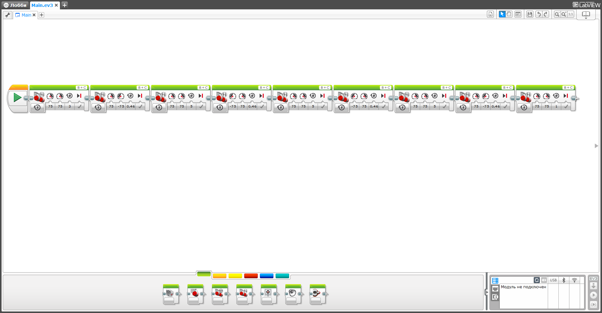

# Робототехника 40

## Вычисления
Основываясь на изображении робота можно оценить соотношение между диаметром колеса и расстояниеммежду точками касания земли колесами.

Примем __диаметр d__ колеса за **16.5 * 2 = 33 у. е.**
__Расстояние D__ между точками касания колес земли за **61 у. е.**
Тогда __длина окружности колеса__ будет равна **Lкол = pi * d = 3.14 * 16.5 * 2 = 103.6 у. е.**
Тогда __длина окружности оси__, проделываемой условной осью, равной расстоянию между колесами **Lокр = pi * D = 3.14 * 61 = 191.5 у. е.**
Тогда __количество оборотов n__, требуемое для разворота на 360 градусов **n = Lокр / Lкол = 191.5 / 103.6 = 1.84 оборотов**
Тогда __количество оборотов n2__, требуемое для разворота на 90 градусов **n2 = n / 4 = 1.84 / 4 = 0.46 оборотов**  

## Программа

