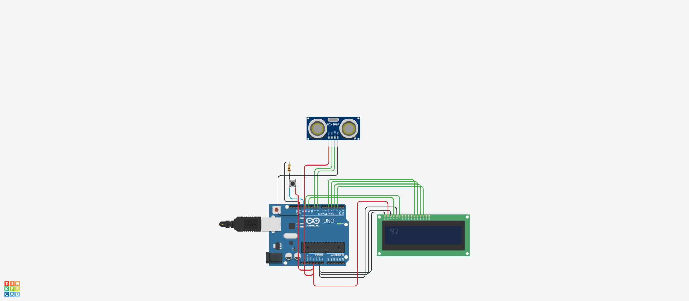

# Робототехника 30

#### [Ссылка на проект tinkercad.com](https://www.tinkercad.com/things/lhdGLslI4Tt-super-sango/editel?sharecode=QGoBtaER1RWAPdowMMJK0l4NlrusjE4uzqOcYqtz9BE)
Cсылка действительная в течении 336 ч. после отправки задания.



## Код прошивки

```c++
#include <LiquidCrystal.h>

#define BUTTON 13
#define TRIG 9
#define ECHO 8

LiquidCrystal lcd(11, 12, 5, 4, 3, 2);

void setup() {
  Serial.begin(9600);
  pinMode(BUTTON, INPUT);
  pinMode(TRIG, OUTPUT);
  pinMode(ECHO, INPUT);
  lcd.begin(16, 2);
}
 
void loop() {
  if (digitalRead(BUTTON)) {
    lcd.clear();
    
    long duration, cm;

    digitalWrite(TRIG, LOW);
    delayMicroseconds(5);
    digitalWrite(TRIG, HIGH);

    delayMicroseconds(10);
    digitalWrite(TRIG, LOW);

    duration = pulseIn(ECHO, HIGH);

    cm = (duration / 2) / 29.1;

    lcd.print(cm);

    delay(250);
  }
}
```